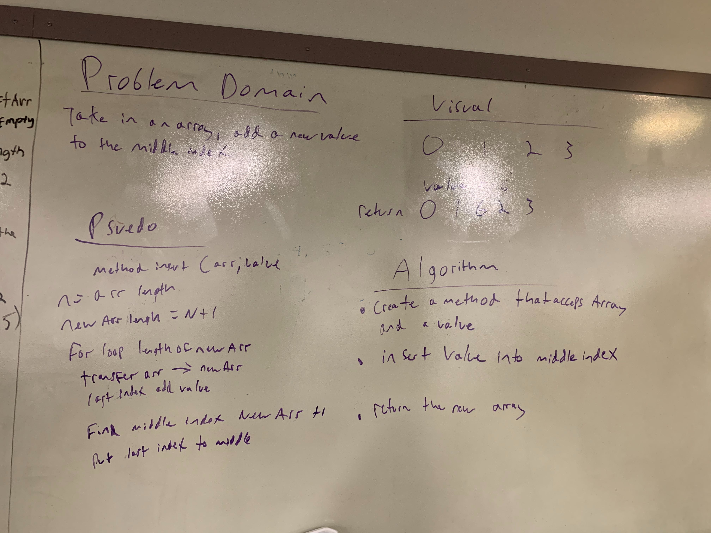
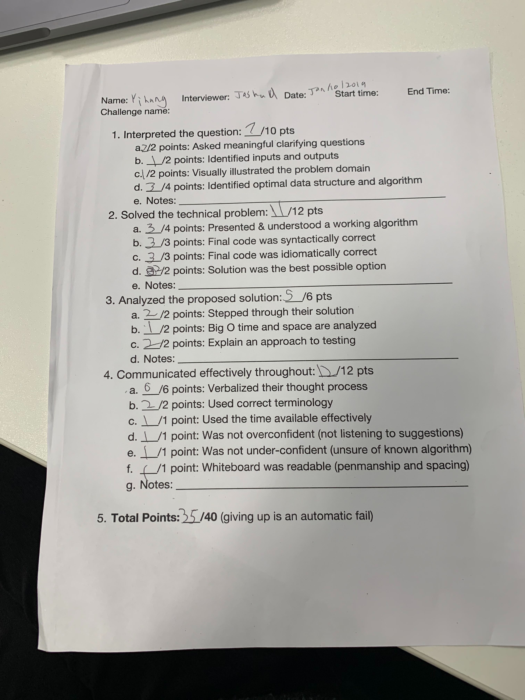
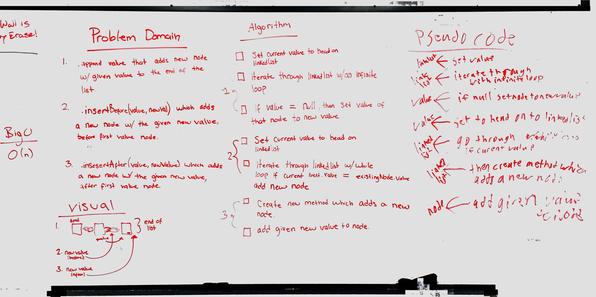
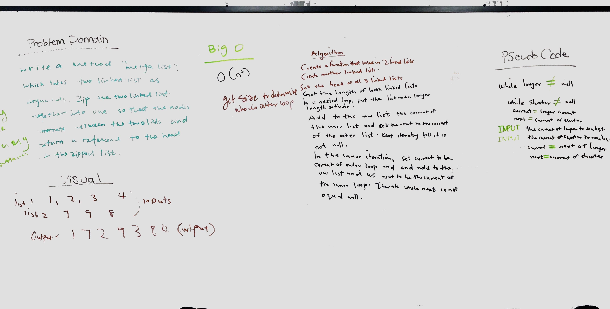

# data-structures-and-algorithms

## linked list
we need to build three method:
* Define a method called insert which takes any value as an argument and adds a new node with that value to the head of the list with an O(1) Time performance.
* Define a method called includes which takes any value as an argument and returns a boolean result depending on whether that value exists as a Node’s value somewhere within the list.
* Define a method called toString (or __str__ in Python) which takes in no arguments and returns a string representing all the values in the Linked List, formatted as:
"{ a } -> { b } -> { c } -> NULL"
## Challenge
1. I am still get used to using the correct syntax for java,
2. I had hard time to write the correct test 

## Approach & Efficiency
I did a lot of search online and watch the youtube video to figure out how to write the test for my code 

## code challenge 01

### Challenge Summary
<!-- Short summary or background information -->

### Challenge Description
<!-- Description of the challenge -->

### Approach & Efficiency
<!-- What approach did you take? Why? What is the Big O space/time for this approach? -->

### Solution
<!-- Embedded whiteboard image -->

## code challenge 02

### Challenge Summary
Write a function called insertShiftArray which takes in an array and the value to be added. Without utilizing any of the built-in methods available to your language, return an array with the new value added at the middle index.
### Challenge Description
The challenge was to get the value inserted into the middle of the array.

### Approach & Efficiency
For this we chose to create a new array that is the length of the old array + 1. We then start inserting the values of the old array into the new array with a for loop until if reaching the middle index. At the middle index the value is inserted into the array, then the next iteration the rest of the array is inputed.

while loop efficiency is 0 (n^2)
### Solution

## code challenge 03

### Challenge Summary
Write a function called BinarySearch which takes in 2 parameters: a sorted array and the search key. Without utilizing any of the built-in methods available to your language, return the index of the array’s element that is equal to the search key, or -1 if the element does not exist.
### Challenge Description
Given an array of integers and an integer, implement a function to take in that array and find whether the integer is in the array. If it is, return the index at which the integer is located at; if not, return -1.

### Approach & Efficiency
Begin by finding an initial midpoint of the array as-is. If the integer is immediately found, return the index of the integer. If not, go into a while loop that attempts to find the integer. If the integer is smaller than the midpoint, calculate a new midpoint that is based on the left half of the existing array boundaries. If the integer is larger, calculate the midpoint for the right half. If integer is equal to new midpoint, return the index. If not, run the while loop again.

### Solution

## code challenge 04

### Challenge Summary
<!-- Short summary or background information -->

### Challenge Description
<!-- Description of the challenge -->

### Approach & Efficiency
<!-- What approach did you take? Why? What is the Big O space/time for this approach? -->

### Solution

## code challenge 05

### Challenge Summary
<!-- Short summary or background information -->

### Challenge Description
<!-- Description of the challenge -->

### Approach & Efficiency
<!-- What approach did you take? Why? What is the Big O space/time for this approach? -->

### Solution
<!-- Embedded whiteboard image -->

## code challenge 06 

### Challenge Summary
<!-- Short summary or background information -->

### Challenge Description
<!-- Description of the challenge -->

### Approach & Efficiency
<!-- What approach did you take? Why? What is the Big O space/time for this approach? -->

### Solution
<!-- Embedded whiteboard image -->

## code challenge 07 

### Challenge Summary
Write a method for the Linked List class which takes a number, k, as a parameter. Return the node’s value that is k from the end of the linked list.

### Challenge Description
The challenge part to me is how to track the kth number 
### Approach & Efficiency
we created a count node and other node also a counter to track kth number. 

### Solution

## code challenge 08

### Challenge Summary
Write a function called mergeLists which takes two linked lists as arguments. Zip the two linked lists together into one so that the nodes alternate between the two lists and return a reference to the head of the zipped list. 
### Challenge Description
It was hard to figure out how to put nodes zip two list so that the nodes alternate between the two lists and return a reference to the head of the new list
### Approach & Efficiency
First we need to create a function to take two two list and know the size of two list; then we tried while loop to loop first list, inside the while loop create another while loop to loop the second list and add the value to the new list

### Solution

